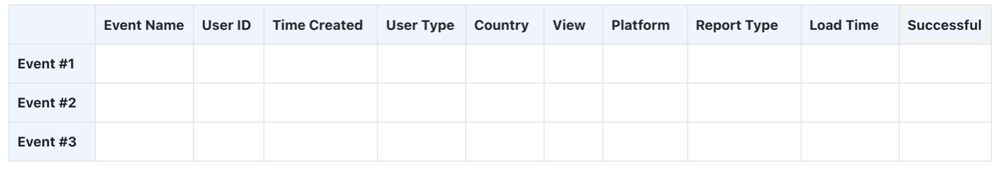
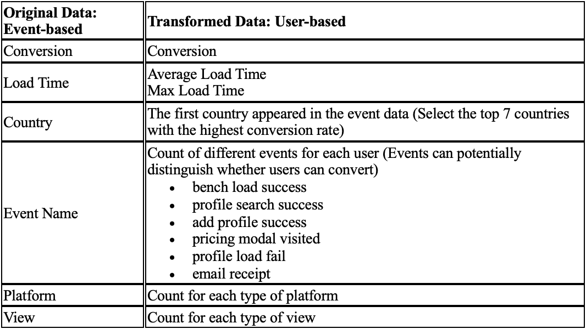
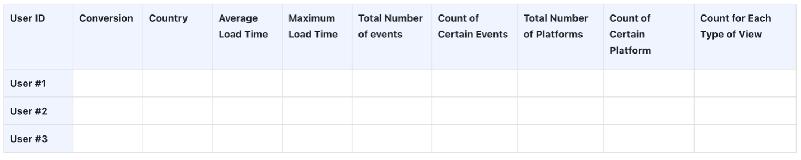

# Socialinsider Prediction Problem

**Capstone project delivered by Kelly (Hoi Mei) Tong, Annie (Xueqing) Wu, Harry (Haochong) Xia, Jaxon Yue**

**(Include Final Project for IDS 707 Data Visualization Course)**

## Index

1. [Problem Statement](#1-problem-statement)
2. [Benchmark Study](#2-benchmark-study)
   - [Motivation](#21-motivation)
   - [Benchmark Performance](#22-benchmark-performance)
3. [Data and Methods (Modeling)](#3-data-and-methods-modeling)
    - [Data Overview](#31-data-overview)
    - [Data Transformation](#32-data-transformation)
    - [Resampling](#33-Resampling)
    - [Model](#34-model)
4. [Results](#4-results)
    - [Interpretation of Results](#41-interpretation-of-results)
    - [Data Visualization (For IDS 707 Final)](#42-data-visualization-for-ids-707-final)
    - [Explanation of Results Tying to Goal](#43-explanation-of-results-tying-to-goal)
5. [Technical Documentation](#5-technical-documentation)
    - [Files Included](#51-files-included)
    - [How to Replicate Our Whole Process](#52-How-to-Replicate-Our-Whole-Process)
6. [Web App](#6-Web-app)
    - [App Introduction](#61-App-Introduction)
    - [Components of the App Folder](#62-Components-of-the-App-Folder)
    - [Using the App](#63-Using-the-App)

## 1. Problem Statement

*Socialinsider* is a social media analytics company that provides data and services for users, like influencers and marketers, to compare performance across channels, get competitor analysis, benchmarks and listening insights. Users have a 14 days free-trial and then can decide to subscribe to the service. *Socialinsider* is trying to gain more subscribed users in order to improve their revenue. The goal of the project is to discover patterns in user activities within *Socialinsider* website and to predict the likelihood of users subscribing the service. 

## 2. Benchmark Study

### 2.1 Motivation
To compare our approach and results with industry-standard practices, we have discovered a benchmark study conducted by a researcher at Northwestern University. The original paper can be found [here](https://sites.northwestern.edu/aprilzhizhou/improving-e-commerce-conversion-rates-with-machine-learning/).

We picked this study because:
* **The study has a similar research problem:** predicting conversion rate from user event data from an e-commerce site.
* **The study uses similar data:** user event data on the e-commerce site from users around the world.
* **The study has an unbalanced dataset:** the overall conversion rate is around 3%. The study uses SMOTE (an oversampling method) to balance the dataset.

### 2.2 Benchmark Performance
The best-performing non-regression model in the benchmark study is an XGBoost classifier, which achieves a precision of 0.360 and a recall of 0.909. These metrics were used as a benchmark to compare our model's performance. Achieving similar results would indicate that our model is competitive with industry-standard practices.

## 3. Data and Methods (Modeling)

### 3.1 Data Overview
- The data we are using is user activities data from website event log including users’ impression, click, add to cart, and purchase. Each row represents an event.
- Event data:

### 3.2 Data Transformation
- Event Data to User Data:
  
- Since we want to predict the probability for each user becoming subscribed user, we need to transform into user-based data and aggregate the features according to each User ID, so that each row represents a user.

- Transformed Event Data:

### 3.3 Resampling
- The data is very imbalanced with conversion rate less than 1%. This will make the impede the modeling process, leading to biased model. Hence, we need to make our data more balanced. We have tried processing methods such as filtering with specific features, SMOTE and resampling. It turned out that resampling is the most effective one. After experimenting different resampling method, we decide to combine under sampling and oversampling method. We duplicate the samples from buy users, which serves as oversampling, and random samples from the not buy users, which serves as under sampling. We adjust the ratio between buy users and not buy users by optimizing the model recall. The final resample training data has 534 samples in buy user class and 1000 samples in not buy class. Some important rules we are following are:
        1.	Only resample the training dataset
        2.	Maintain the buy user as the minority, even though making buy users as majority can have better recall

### 3.4 Model

- We have tried different types of models:

  - Traditional Model:
    -	Logistic Regression
    -	k-Nearest Neighbor
    -	Decision Tree
  - Ensemble Method:
    -	Random Forest
    -	Gradient Boosting
    -	XGBoost
  - Neural Network:
    - MLP Classifier

For each model process, we follow the procedures below:

- Feature Scaling—to ensure all features contribute equally to the model’s performance
-	Grid Search—to systematically test combinations of hyperparameters to find the best configuration
-	Cross Validation—to reduce overfitting and improve generalization
-	Model Evaluation—to assess performance metrics including accuracy, precision, recall, F1, confusion matrix, and more

Finally, Gradient Boosting performs the best among all models, and we select the gradient boosting model as our final model. 

## 4.Results

### 4.1 Interpretation of Results

With primarily optimization for recall while keeping a reasonable balance between tradeoff of precision for recall, Gradient Boosting model is considered as the best performing model among the list of models we experimented. This Gradient Boosting model trained with the transformed resampled data, has reached a recall of 0.8696 and a precision of 0.125. The recall indicates that the model accurately identifies 86.96% of all the users who would have converted and ensures an optimal capture of potential convertors. The precision of 0.125 indicates that 12.5% of predicted positives convert, with the remaining 87.5% identified as prospects—users who show traits of converters but haven’t converted yet. By directing more focused marketing toward these prospects, we anticipate increasing conversions. 

With comparison to the industry benchmark we have researched on, this result is very close to the goal. The industry benchmark has a recall of 0.909 and a precisio of 0.360. However, their data shows an original conversion rate of 3%, which is more than three times our conversion rate. With an even more umbalance dataset compared to the benchmark study, we consider our recall of 0.8696 and precision of 0.125 as huge improvement on the model prediction performance already. 

#### 4.2 Data Visualization (For IDS 707 Final)

### 4.3 Explanation of Results Tying to Goal

As demonstrated by the visualization and previous context, our model is selected mainly based on recall optimization. Optimizing for recall ensures least probability in losing our potential user who would have converted. While optimizing for precision would make the model overly conservative, predicting most cases as negative due to the data’s imbalance. In the case of optimizing for precision, only 2 to 5 cases will be predicted as positive and actually converted in real life. This would be less effective for a marketing-focused model like ours. 

(More explanation on the difference between precision and recall is explained in conextual section of "Final Project for IDS 707 Data Visualization Course.")

## 5. Technical Documentation

### 5.1 Files Included

The repository for our capstone project can be found [here](https://github.com/XueqingWu/capstone_project). It contains all the necessary files and code to replicate the project. The main folders are `App`, `Data_Pipeline`, `EDA`, `Final_Data`, `Modeling`, and `Raw_Data`. Below is a brief description of each folder:

- **App**: Contains files for the deployment of the web application for predicting subscription conversion. Key files include:
  - `best_model.pkl`: The saved model used for making predictions.
  - `cvr_prediction_app.py`: The main script for running the web application.
  - `scaler.pkl`: The scaler used for feature normalization.
  - `requirements.txt`: Lists all the dependencies required to run the application smoothly.
  - `socialinsider_logo.png`: Logo used in the web application interface.

- **Data_Pipeline**: Contains the data transformation pipeline.
  - `Transform_Resample_Data.ipynb`: A Jupyter notebook that involves all processes required to transform and resample the original event-level data to user-level data. It also includes the resampling process and outputs the final data for modeling.

- **EDA**: Contains files related to exploratory data analysis.
  - `Social_Insider_EDA_DataViz.ipynb`: Jupyter notebook that includes the code for generating exploratory data analysis visualizations.
  - `Socialinsider Exploratory Data Analysis.pdf`: Report detailing the findings of the exploratory data analysis.

- **Final_Data**: Contains the transformed and resampled data ready for modeling.
  - `X_test.csv`, `X_train_resampled_optrecall.csv`, `y_test.csv`, `y_train_resampled_optrecall.csv`: Training and testing data files used in the modeling phase.

- **Modeling**: Contains the modeling notebook.
  - `Model.ipynb`: Jupyter notebook that contains the model training process of all models we tried and evaluation. It also exports the best model and the predicted probabilities of users' conversion rate of the data we have in the end.

- **Raw_Data**: Contains the raw data provided by Socialinsider.
  - Monthly CSV files such as `socialinsider_events_2024-05.csv`, `socialinsider_events_2024-06.csv`, etc.
  - `Capstone_Visual_Final_Project_IDS_707.pdf`: Final report of the capstone project.

- **Generated_Data**: Contains the data generated by our app using the test data provided by Socialinsider.
  - `predicted_user_data.csv`: output CSV computed by our app.

### 5.2 How to Replicate Our Whole Process

1. Clone the repository from GitHub to your local machine.
2. Run the `Transform_Resample_Data.ipynb` to export the final data.
3. Run the `Model.ipynb` to export the best model and the predicted probabilities of users' conversion rate of the data we have. 

## 6. Web App

### 6.1 App Introduction
The **Customer Conversion Prediction Tool** is a Streamlit web application that automates our pipeline for predicting user conversion rates. The app takes in raw event data, preprocesses it,  uses our best-performing model (Gradient Boosting Classifier) to predict the conversion rate of each user, and outputs the results in a downloadable CSV file.

### 6.2 Components of the App Folder
The `App` folder contains the following components:

| File Name           | Description                                         |
|---------------------|-----------------------------------------------------|
| `best_model.pkl`    | The best-performing model we trained (Gradient Boosting). |
| `cvr_prediction_app.py` | The main Streamlit application script.          |
| `requirements.txt`  | A list of dependencies required to run the app. This includes libraries such as Streamlit, pandas, and scikit-learn. |
| `scaler.pkl`        | A saved `StandardScaler` object used to scale the data during model training and inference. This ensures the uploaded data is scaled correctly before making predictions. |
| `socialinsider_logo.png` | The logo displayed in the app interface.         |

### 6.3 Using the App

1. **Go to the App website:**  
   [http://sipredict.streamlit.app](http://sipredict.streamlit.app)

2. **Upload the event data:**
    - Click the `Browse files` button to upload your event data in CSV format.
    - The app expects the data to have the same format as the raw event data, which can be found in the `Data` folder.

3. **View/Download the prediction results:**
    - The app will preprocess the data, applies necessary transformations, and computes predictions using the best model.
    - The results will be displayed in a sortable and interactive table.
    - You can also download the results as a CSV file by clicking the `Download Results CSV` button.
